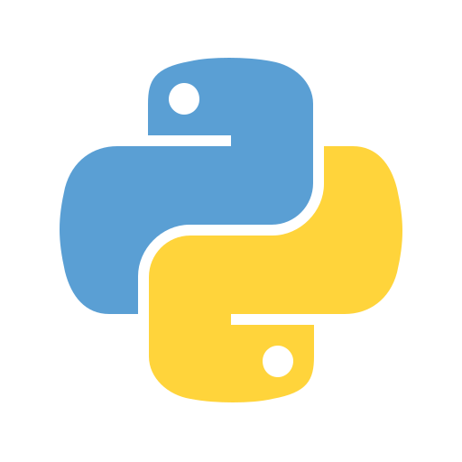

# About me
Aspiring junior developer, general interest in all things technology (mostly CS related) related but my main interests are:

  - Operating systems (especially Linux scripts)
  - Web development full stack (currently finishing my Odin project which teaches javascript and ruby on top of html and css)
  - Data structures and design pattern in programming

My main ambitions in life are self improvement and making life more easier for people with the help of technology
=======
# About me
---

Aspiring junior developer, general interest in all things technology (mostly CS related) related but my main interests are:

  * Operating systems (especially Linux scripts)
  * Web development full stack (currently finishing my Odin project which teaches javascript and ruby on top of html and css)
  * Data structures and design pattern in programming

My main ambitions in life are self improvement and making life more easier for people with the help of technology

## Skills
---

## Latest project's for clients
---
## https://tesla-najem.vercel.app/
